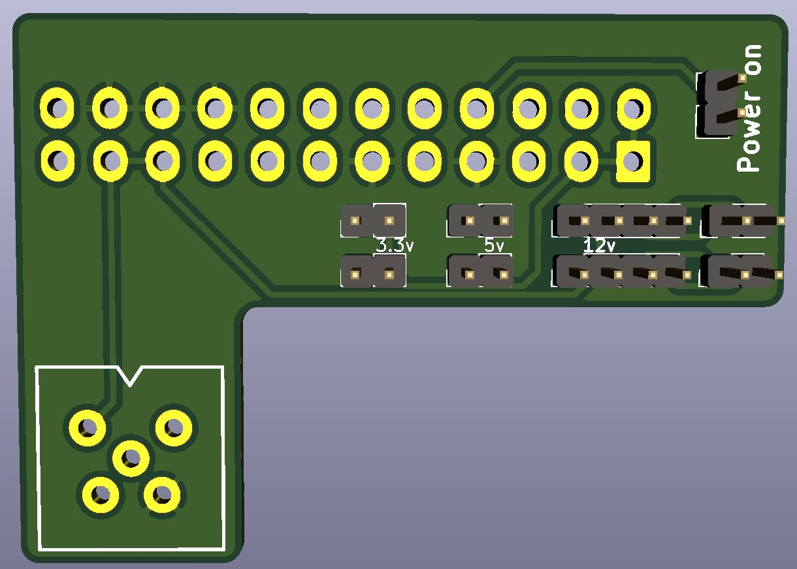

# RCEU1205
 ATX to Amiga Power adapter for A500/600/1200 Tower
 
Make note that the pcb has not been testet yet, and shouldn't be considered a release just yet. 

# BOM

w/everything (*)
1x 24 pin ATX connector
5x Pins salvaged from a DIN connector
2x 4pin SIL header
7x 2pin SIL header

bare minimum (*)
1x 24 pin ATX connector
5x Pins salvaged from a DIN connector
1x 2pin SIL header

# Putting it all together
The pins from the DIN connector is soldered into the square din holes.

# Description
J2 is the power connector for the ATX power supply.

There are 2x 4pins headers for 12v psu's  pin1 = gnd, pin2 = 12v, pin3 = sense, pin4 = control
The 2x 2pins headers to the right gains access to pin 3 and 4 accordingly to the 12v pin header, in case you want to control the 12v fans using an arduino or similar.

There are 2x 2pins headers for 5v
And there are 2x 2pins headers for 3.3v
You can use these for whatever you want.

(*) the extra pin headers are not needed, but can be an extra help if you want to i.e. control fans using an arduino and temperature sensor.

